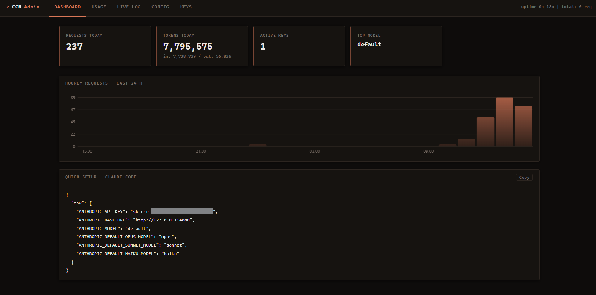

<div align="center">

# Claude Code Router

A local proxy that sits between your LLM clients and your providers. Point Claude Code, Cursor, or anything Anthropic/OpenAI-compatible at it, and it handles the rest.

  [](https://github.com/blobbyblo/ClaudeCodeRouter/actions/workflows/ci.yml)
  [](https://github.com/blobbyblo/ClaudeCodeRouter/actions/workflows/release.yml)
  <a href="https://opensource.org/licenses/MIT"></a>
  <a href="#"></a>

<br/>
<br/>


</div>

---

## What is it?

CCR lets you route your LLM traffic through a single local server. Point any Anthropic-compatible client at it, and CCR handles the rest: load balancing between providers, failing over to backup models when one is unavailable, tracking usage and costs per API key, and managing credentials from a web dashboard.

It is particularly useful if you are:

- Working across multiple LLM providers
- Self-hosting internal models via OpenAI-compatible endpoints alongside commercial APIs
- Using [Claude Code](https://github.com/anthropic/claude-code-cef) and want a single place to manage model access

---

## Features

- **Unified Anthropic API** — present one endpoint to your clients; route to Anthropic, OpenAI, or any OpenAI-compatible backend
- **Smart Fallbacks** — define model chains so requests automatically retry backup models or providers when the primary is down or rate-limited
- **API Key Management** — mint and revoke per-client keys with built-in usage tracking
- **Live Admin Dashboard** — built-in web UI with real-time request logs, token consumption charts, and key management
- **Hot Config Reload** — edit `config.toml` while the server is running; no restarts needed
- **Pure Go, No CGO** — ships as a single static binary on any Go-supported platform
- **SQLite-backed** — zero external database dependencies; everything stores locally

---

## Table of Contents

- [Quick Start](#quick-start)
- [Configuration](#configuration)
- [Admin Dashboard](#admin-dashboard)
  - [Creating client keys](#creating-client-keys)
  - [Adding providers](#adding-providers)
  - [Configuring models](#configuring-models)
  - [Viewing usage](#viewing-usage)
- [API Reference](#api-reference)
- [Architecture](#architecture)
- [Development](#development)
- [License](#license)

---

## Quick Start

### Install (no Go required)

Download and run the install script for your platform — it fetches the latest pre-built binary from [GitHub Releases](https://github.com/blobbyblo/ClaudeCodeRouter/releases/latest).

**Windows** — run `setup.bat` from the repo, or use the one-liner in PowerShell:

```powershell
irm https://raw.githubusercontent.com/blobbyblo/ClaudeCodeRouter/main/setup.ps1 | iex
```

**Linux / macOS** — run in your terminal:

```bash
curl -fsSL https://raw.githubusercontent.com/blobbyblo/ClaudeCodeRouter/main/install.sh | bash
```

The script installs the binary, writes a sample `config.toml`, and optionally registers a background service.

### Connect Your Client

Use your client key (created via the admin dash) as the API key. Point your app at `http://127.0.0.1:4080/v1/messages` for Anthropic format, or `http://127.0.0.1:4080/v1/chat/completions` for OpenAI format.

### For contributors (requires Go 1.26+)

```bash
git clone https://github.com/blobbyblo/ClaudeCodeRouter.git
cd ClaudeCodeRouter
make build            # outputs bin/ccr
make run              # or go run ./cmd/ccr
```

The server starts on port `4080` (client) and `4081` (admin dashboard). Edit `config.toml` to add your API keys and model aliases.

---

## Configuration

CCR uses a single `config.toml` file. The server creates a default one the first time it starts. Here is a typical setup:

```toml
[server]
client_port = 4080
admin_port  = 4081
log_level   = "info"

[providers.anthropic]
base_url   = "https://api.anthropic.com"
convention = "anthropic"

[providers.deepnim]
base_url   = "http://localhost:8123"
convention = "openai"

[[models]]
alias       = "opus"
fallback_to = "sonnet"

[[models.providers]]
provider = "anthropic"
model_id = "claude-opus-4-7"

[[models]]
alias = "sonnet"

[[models.providers]]
provider = "deepnim"
model_id = "deepseek-v3"
```

Key ideas:

- **Providers** define how to talk to a backend (`anthropic` or `openai` convention).
- **Models** are aliases you send from your client (e.g., `opus`). Each alias maps to one or more real model IDs on one or more providers, plus an optional `fallback_to` chain.
- **Provider keys** are stored in the database (not the config file) and managed through the admin UI.

---

## Admin Dashboard

Open `http://127.0.0.1:4081` in your browser.

### Creating client keys

Navigate to **Keys** in the dashboard. Click **New Key**, give it a name, and a token like `sk-ccr-xxx` is generated. Hand this token to your client app; every request made with it is tracked and can be revoked later.

### Adding providers

Visit **Providers** in the dashboard. Add the provider's `name`, `base_url`, and `convention` (`anthropic` or `openai`). Then switch to the **Keys** tab for that provider and add one or more API keys. CCR rotates through keys per provider in round-robin fashion.

### Configuring models

Visit **Models** in the dashboard. Add an **alias**, pick which provider to route through, and map it to the actual remote model ID. If you want a fallback chain, set **Fallback To** to another model alias. Edit config directly via **Raw Config** if you prefer.

### Viewing usage

The **Dashboard** page shows live request streams, hourly token usage graphs, and per-key summaries. Everything is stored in the local SQLite database (default `ccr.db`).

---

## API Reference

CCR exposes a standard Anthropic-compatible API on the client port. All endpoints require authentication via `x-api-key` header or `Authorization: Bearer <key>`.

| Endpoint | Method | Description |
|---|---|---|
| `/v1/messages` | `POST` | Anthropic Messages API |
| `/v1/chat/completions` | `POST` | OpenAI Chat Completions API (returns OpenAI format) |
| `/v1/models` | `GET` | List configured model aliases |

The admin API is available under `/admin/api/` for programmatic access.

---

## Architecture

```
  +--------+     +------------------------+     +-------------------+
  | Client | --> |  CCR Client Server     | --> | Anthropic API     |
  +--------+     |  (port 4080)           |     +-------------------+
                 |                        |
                 |  - Key auth             |     +-------------------+
                 |  - Model resolution     | --> | OpenAI / NIM / ...|
                 |  - Fallback chain       |     +-------------------+
                 |  - Rate-limit retry     |
                 +------------------------+
                  |
                  v
         +------------------------+
         | CCR Admin Server       |     +---------+
         | (port 4081)            | --> | SQLite   |
         |                        |     | Database |
         |  - Web dashboard        |     +---------+
         |  - Key management       |
         |  - Usage analytics       |
         |  - Real-time logs       |
         +------------------------+
```

---

## Development

```bash
# Run tests
make test

# Build release binary
make release        # creates bin/ccr-linux-amd64

# Clean build artifacts
make clean
```

- `cmd/ccr/` — main entry point
- `router/` — HTTP proxy, request routing, and fallback logic
- `providers/` — provider implementations (Anthropic, OpenAI conventions)
- `admin/` — admin HTTP server and embedded web dashboard
- `db/` — SQLite schema and queries
- `config/` — TOML config loader with hot-reload watcher
- `middleware/` — auth and SSE log broadcaster

---

## License

Distributed under the MIT License.
